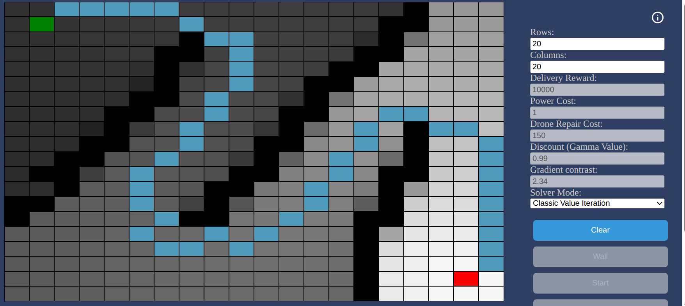
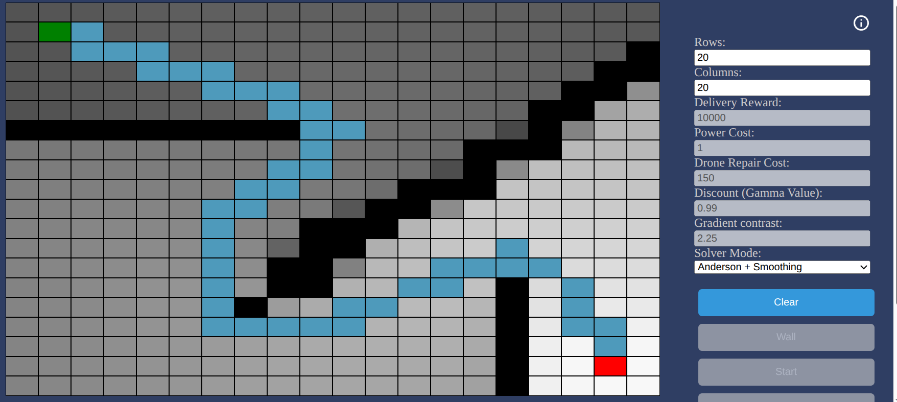

# Evolution of the Drone Pathfinder

This document details the theoretical transition from a standard discrete Markov Decision Process (MDP) baseline (https://github.com/ph4nt0m37x/drone-pathfinder) to an enhanced system. The primary objective was to reduce convergence time, stabilize the value landscape, and optimize the resulting trajectory.

## 1. Convergence Acceleration: Anderson Acceleration

The original implementation utilized standard Value Iteration via the Gauss-Seidel method, where the value function is updated in-place. While intuitive, this approach converges linearly and becomes inefficient as the discount factor $\gamma$ approaches $1$.

### The Fixed-Point Problem
We define the Bellman Optimality Operator $T$ such that the optimal value function $V^*$ is the fixed point:

$$V^* = T(V^*)$$

Standard iteration follows the sequence $V_{k+1} = T(V_k)$. To accelerate this, we implement **Anderson Acceleration (AAVI)**, which treats the solver as a non-linear fixed-point iteration.

### The Optimization Logic
Rather than relying solely on the most recent iterate $V_k$, AAVI utilizes a history of $m$ previous iterates and their corresponding Bellman updates $F_i = T(V_i)$.

The method computes a weighted combination of these updates to find a new estimate that minimizes the combined residual $r_i = F(V_i) - V_i$:

$$\min_{\alpha} \left\| \sum_{i=0}^{m-1} \alpha_i r_i \right\|_2^2 \quad \text{subject to} \quad \sum_{i=0}^{m-1} \alpha_i = 1$$

### Derivation of the Linear System
To solve this constrained optimization, we employ the method of Lagrange Multipliers. We define the Lagrangian $\mathcal{L}$:

$$\mathcal{L}(\alpha, \lambda) = \frac{1}{2} \left\| \sum_{i=0}^{m-1} \alpha_i r_i \right\|_2^2 - \lambda \left( \sum_{i=0}^{m-1} \alpha_i - 1 \right)$$

Taking the partial derivative with respect to each weight $\alpha_k$ and setting it to zero:

$$\frac{\partial \mathcal{L}}{\partial \alpha_k} = \sum_{j=0}^{m-1} \alpha_j (r_k^T r_j) + \lambda = 0$$

Taking the partial derivative with respect to $\lambda$:

$$\frac{\partial \mathcal{L}}{\partial \lambda} = \sum_{i=0}^{m-1} \alpha_i - 1 = 0$$

This yields the augmented system $A\mathbf{x} = \mathbf{b}$:

$$\begin{bmatrix}
r_0^T r_0 & \dots & r_0^T r_{m-1} & 1 \\
\vdots & \ddots & \vdots & \vdots \\
r_{m-1}^T r_0 & \dots & r_{m-1}^T r_{m-1} & 1 \\
1 & \dots & 1 & 0
\end{bmatrix}
\begin{bmatrix} \alpha_0 \\ \vdots \\ \alpha_{m-1} \\ \lambda \end{bmatrix} =
\begin{bmatrix} 0 \\ \vdots \\ 0 \\ 1 \end{bmatrix}$$

The resulting coefficients $\alpha_i$ allow the solver to extrapolate the value function, effectively "leaping" toward the fixed point $V^*$ and reducing the number of required iterations by an order of magnitude.

---

## 2. Value Regularization: Soft-Max Bellman Operator

The original baseline used the Hard-Max operator: $V(s) = \max_a Q(s,a)$. This often results in "plateaus" in the value landscape and sharp, unstable policy shifts near obstacles.

### Entropy Regularization
To stabilize the value field, we replace the hard maximum with a **Soft-Max (Log-Sum-Exp)** operator, introducing a temperature hyperparameter $\tau > 0$:

$$V_{\text{soft}}(s) = \tau \ln \sum_{a \in \mathcal{A}} \exp \left( \frac{Q(s,a)}{\tau} \right)$$

### Impact on the MDP
1.  **Landscape Smoothing:** The resulting value function $V(s)$ becomes a differentiable, continuous field. This eliminates the "blocky" nature of the utility gradient.
2.  **Probabilistic Buffering:** As $\tau$ increases, the agent accounts for the entropy of the action space. Mathematically, this forces the agent to maintain a safety margin around high-cost states (obstacles), as the influence of sub-optimal, dangerous actions is smoothed into the overall value of the state.

---

## 3. Trajectory Optimization: Gradient Descent Smoothing

The original rollout produced a discrete "stair-step" path, as it simply followed the cell-to-cell indices of the optimal policy.

### The Force-Based Approach
Instead of simply highlighting cells, we treat the discrete path as a series of particles connected by springs, subject to two competing forces:

**1. Internal Tension (Smoothness):**
A force that pulls each point toward the average position of its immediate neighbors. This acts as a low-pass filter, removing the zig-zags of the grid:

$$\vec{F}_{\text{smooth}} \propto \left( \frac{\vec{p}_{i-1} + \vec{p}_{i+1}}{2} \right) - \vec{p}_i$$

**2. External Repulsion (Obstacle Avoidance):**
To prevent the smoothed path from clipping through walls, each obstacle exerts a repulsive force. This force follows an inverse-cube law, meaning it is negligible at a distance but becomes an impassable "wall" as the path approaches an obstacle:

$$\vec{F}_{\text{repel}} \propto \sum \frac{\vec{p}_i - \vec{obs}}{\|\vec{p}_i - \vec{obs}\|^3}$$

### Result
The final trajectory is the equilibrium reached by iterating these forces via Gradient Descent. The result is a path that maintains the optimality of the MDP solver but presents as a fluid, natural curve that respects the physical constraints of the environment, while reducing the environment collision risk.

  
   <i>Figure 1: Baseline discrete trajectory exhibiting "stair-step" artifacts.</i>

  
   <i>Figure 2: Optimized trajectory after applying Gradient Descent smoothing.</i>

